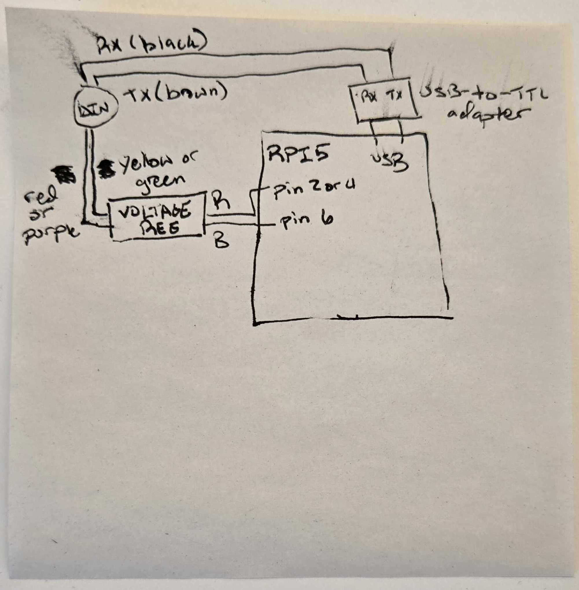

# Roomba 650/655 Hardware Setup Tutorial

Complete guide for connecting a Raspberry Pi to a Roomba 650/655 using the Viam platform.

---

## Components Required

| Component | Specification | Example |
|-----------|---------------|---------|
| Roomba 650/655 | 600 series with Open Interface | iRobot Roomba 650 or 655 |
| Raspberry Pi | Any model with USB port | Raspberry Pi 5 (recommended) |
| Mini-DIN Cable | 7-pin for Roomba | [Adafruit #2438](https://www.adafruit.com/product/2438) |
| USB-to-TTL Adapter | 5V tolerant serial adapter | FTDI, CP2102, or CH340-based |
| Voltage Regulator | 5V output, handles 11-16V input | Buck converter (LM2596 or similar) |
| Jumper Wires | For connections | Male-to-female recommended |

---

## Mini-DIN Connector Pinout

The Roomba's 7-pin Mini-DIN connector provides serial communication and power:


**Important:** Pins 1 and 2 are connected to the Roomba's battery through a 200mA PTC resettable fuse.

---

## Wiring Instructions

### Step 1: Power Connection (UBEC → Pi)

**⚠️ WARNING:** The Roomba battery provides 11-16V unregulated. Connecting directly to the Pi will damage it!

**Pre-wired components** (already prepared):
- Mini-DIN cable wires stripped and soldered to UBEC input
- Roomba Vpwr (Pin 1/2) → UBEC VIN+
- Roomba GND (Pin 6/7) → UBEC VIN-
- UBEC (Adafruit #1385) outputs regulated 5V via 3-pin servo connector

**UBEC Output Connector Pinout:**
The 3-pin female servo connector has:
- **Pin 1 (Black/Brown wire):** Ground
- **Pin 2 (Red wire):** 5V Power
- **Pin 3:** Not connected (NC)

**Your task:**

1. **Prepare jumper wires:**
   - Take 2x male-to-female jumper wires (red and black recommended)
   - You'll only use 2 of the 3 UBEC output pins

2. **Connect UBEC to Raspberry Pi GPIO:**
   - Male end of RED jumper → UBEC Pin 2 (red/5V)
   - Male end of BLACK jumper → UBEC Pin 1 (black/GND)
   - Female end of RED jumper → Pi GPIO Pin 2 or 4 (5V)
   - Female end of BLACK jumper → Pi GPIO Pin 6 (GND)
   - Pin 3 is not connected (ignore it)

3. **Verify (optional but recommended):**
   - Before connecting to Pi, use multimeter to verify 5V output
   - Should read 5.0-5.2V between red and black wires

**Note:** The UBEC is already wired to the Roomba battery through the Mini-DIN cable.

---

### Step 2: Serial Communication (Roomba ↔ USB-to-TTL ↔ Pi)

**⚠️ CRITICAL:** The Roomba uses 5V logic on TXD/RXD. Direct connection to Pi GPIO (3.3V) may damage the Pi. Use a USB-to-TTL adapter instead, which handles voltage differences safely.

1. **Configure USB-to-TTL adapter**:
   - Set the voltage jumper to 5V mode
   - This ensures the adapter can properly read the Roomba's 5V signals

2. **Wire connections** (cross TX/RX):
   ```
   Roomba Pin 3 (RXD) → USB-to-TTL TX pin
   Roomba Pin 4 (TXD) → USB-to-TTL RX pin
   ```
   **Remember:** TX goes to RX, RX goes to TX (crossed connections)

3. **Connect USB-to-TTL to Pi**:
   - Plug USB-to-TTL adapter into any Pi USB port
   - No GPIO pins needed for serial communication

---

### Step 3: Optional - BRC (Baud Rate Change) Pin

The BRC pin (Pin 5) can be used to prevent the Roomba from sleeping, but is **not required** for basic operation. Skip this for initial setup.

---

## Connection Diagram



**Note:** If you need clarification on any part of this diagram, ask Jalen.

---

## Safety Checklist

Before powering on, verify:

- [ ] Voltage regulator output is 5V (measure with multimeter)
- [ ] All ground connections are secure
- [ ] No short circuits between power and ground
- [ ] USB-to-TTL adapter is properly inserted in Pi USB port
- [ ] TX/RX connections are crossed (TX → RX, RX → TX)
- [ ] Roomba battery is charged (press Clean button to check)

---

## Troubleshooting

**Problem:** Pi doesn't power on
- Check voltage regulator output with multimeter (should be 5.0-5.2V)
- Verify Roomba battery is charged (press Clean button)
- Check all power connections are secure

**Problem:** Serial port not detected
- Run `lsusb` to verify USB-to-TTL is recognized
- Try different USB port on Pi
- Check USB-to-TTL driver installation

**Problem:** No response from Roomba
- Press Clean button to wake Roomba
- Verify TX/RX wires are crossed correctly
- Check baud rate is 115200 (default for Roomba 650/655)
- Try sending Start command (byte 128) multiple times

**Problem:** Roomba goes to sleep after 5 minutes
- This is normal Open Interface behavior
- Send any OI command to keep awake
- Or implement BRC pin pulsing (advanced)

---

## Notes on the Hardware

- **Battery life:** Powering the Pi from Roomba reduces battery runtime. Monitor battery voltage.
- **200mA fuse:** The Vpwr pins have a 200mA PTC fuse. Pi 5 may draw more under load; consider external power for production use.
- **Serial communication:** The Roomba uses 115200 baud by default on 650/655 models.
- **3.3V compatibility:** The Roomba can read 3.3V GPIO signals from the Pi, but outputs 5V which can damage Pi GPIO. USB-to-TTL handles this safely.

---

## References

- [Adafruit Mini-DIN Cable Product Page](https://www.adafruit.com/product/2438)
- [iRobot Roomba Open Interface Pinout](https://pinoutguide.com/Electronics/irobot_roomba_serial_pinout.shtml)
- [Pi Streaming Roomba Tutorial](https://yakinikuman.github.io/pistreaming_roomba/)
- [Create 2 Open Interface Specification](https://cdn-shop.adafruit.com/datasheets/create_2_Open_Interface_Spec.pdf)
